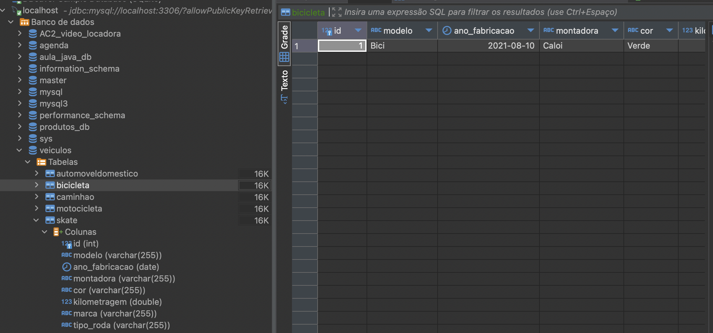

# SISTEMA_VEICULOS
# Um sistema de gerenciamento de veículos com Banco de Dados!

Uma empresa necessita de um sistema informatizado. Nesse sistema serão cadastrados seus automóveis

### 🖼️ Exemplo da Interface Gráfica


## 🚀 Começando
O objetivo do exercício é fazer se familiarizar com heranças, classes e super-classes.

Dar exemplos
## 🔧 Instalação
O projeto é composto por diretórios que trabalham juntos.

## 🛠️ Construído com
Ferramentas utilizadas e bibliotecas
Biblioteca: LocalDate.
Banco de dados: MySql

Dbeaver
IDE Eclipse
## 💾 Configuração do Banco de Dados

1. Configure o **DBeaver** para gerenciar o banco de dados MySQL.
2. Crie o banco de dados `agenda` com a seguinte tabela:

```sql
-- Criar o banco de dados
CREATE DATABASE veiculos;

-- Usar o banco de dados
USE veiculos;

CREATE TABLE automoveldomestico (
    id INT AUTO_INCREMENT PRIMARY KEY,
    modelo VARCHAR(255),
    ano_fabricacao VARCHAR(255),  -- Alterando de DATE para VARCHAR
    montadora VARCHAR(255),
    cor VARCHAR(255),
    kilometragem DOUBLE,
    qtd_max_passageiros INT,
    tipo_freio VARCHAR(255),
    airbag TINYINT(1)  -- BOOLEAN substituído por TINYINT(1)
);


CREATE TABLE motocicleta (
    id INT AUTO_INCREMENT PRIMARY KEY,
    modelo VARCHAR(255),
    ano_fabricacao DATE,
    montadora VARCHAR(255),
    cor VARCHAR(255),
    kilometragem DOUBLE,
    cilindrada INT,
    torque DOUBLE
);

CREATE TABLE caminhao (
    id INT AUTO_INCREMENT PRIMARY KEY,
    modelo VARCHAR(255),
    ano_fabricacao DATE,
    montadora VARCHAR(255),
    cor VARCHAR(255),
    kilometragem DOUBLE,
    carga DOUBLE,
    eixos INT
);

CREATE TABLE bicicleta (
    id INT AUTO_INCREMENT PRIMARY KEY,
    modelo VARCHAR(255),
    ano_fabricacao DATE,
    montadora VARCHAR(255),
    cor VARCHAR(255),
    kilometragem DOUBLE,
    marca VARCHAR(255),
    material VARCHAR(255),
    qtd_marchas INT,
    amortecedor BOOLEAN
);

CREATE TABLE skate (
    id INT AUTO_INCREMENT PRIMARY KEY,
    modelo VARCHAR(255),
    ano_fabricacao DATE,
    montadora VARCHAR(255),
    cor VARCHAR(255),
    kilometragem DOUBLE,
    marca VARCHAR(255),
    tipo_roda VARCHAR(255)
);

```

### 🖼️ Exemplo de Inserts


## 📌 Versão
Versão 1.0

## ✒️ Autores
Taynara Raquel
